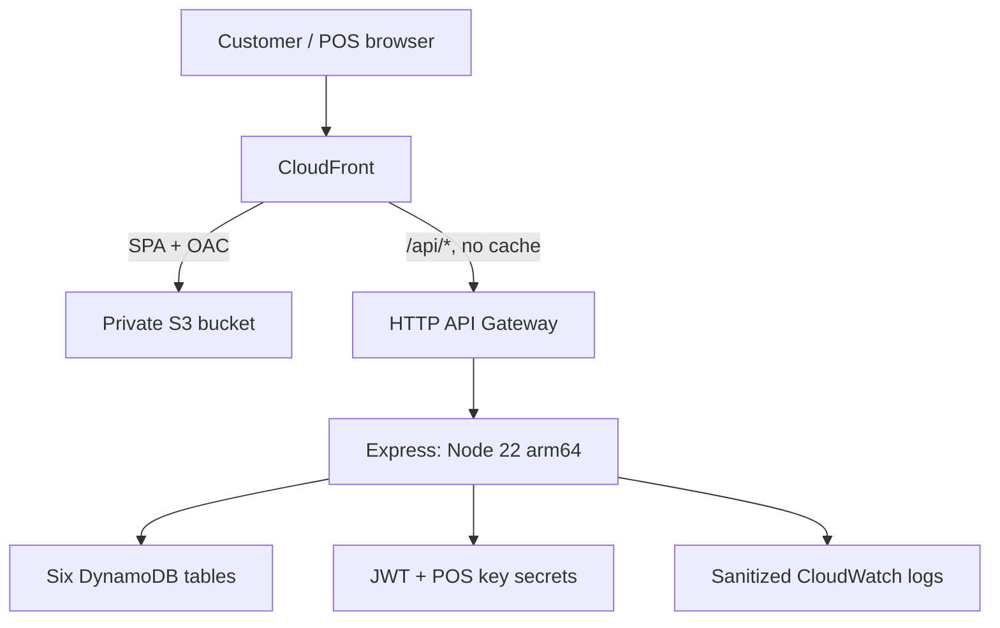

# SmartClub 2.0

One loyalty program for Farmaenlace in Ecuador. A single cédula account participates in every active liga: Liga Ahorro for Farmacias Económicas, and Liga Wellness for Medicity, Wellderma, Mascotas and Ambiente. Purchases, monthly levels and rewards accumulate independently in each liga. Registration needs only a valid cédula and privacy consent; email is optional.

[spec/SPEC-001.md](spec/SPEC-001.md) amends [SPEC-000](spec/SPEC-000.md). All customer copy is Spanish; money is integer USD cents; calendar months use America/Guayaquil (UTC−05:00).

| Package        | Responsibility                                                                                |
| -------------- | --------------------------------------------------------------------------------------------- |
| `@club/shared` | Program catalog, validation, pure tier/streak/discount/receipt rules, public contracts        |
| `@club/api`    | Express API, customer/POS authentication, memory/DynamoDB storage, seed and migration tooling |
| `@club/ui`     | React SPA, multi-liga account, wallet, history, POS simulator and printable QR posters        |
| `@club/infra`  | One CDK app stack per stage, API, data, hosting and optional GitHub OIDC role                 |



## Run locally

Use Node 22 LTS (22.12+) and the pinned pnpm 10 version in `packageManager`.

```sh
nvm use
corepack enable
pnpm install
cp packages/api/.env.example packages/api/.env
pnpm dev
```

Open `http://localhost:5173`. The memory driver seeds synthetic demo data automatically. Enter the deliberately fake local POS key `obviously-fake-local-pos-key` at `/caja`. Example secrets are only for local development. The browser stores customer sessions under `smartclub-session` in localStorage and POS credentials under `smartclub-pos` in sessionStorage; a current session can also operate with storage disabled.

For persistence with DynamoDB Local:

```sh
docker compose up -d dynamodb
# Set DATA_DRIVER=dynamodb in packages/api/.env
pnpm --filter @club/api db:setup
pnpm --filter @club/api seed --local --demo
pnpm dev
```

Local table names are `smartclub-local-<LogicalName>`. The client supplies fake local credentials. DynamoDB Local uses memory storage, so rerun setup/seed after restarting its container. Arguments go directly after pnpm scripts, without an extra `--` separator.

## Demo walkthrough

Seed data is relative to the current month M. Two CIs, `1700000035` and `1700000043`, remain unregistered for registration demos.

| Cédula       | Email                     | Starting activity / demo                                                                                                                                                                                        |
| ------------ | ------------------------- | --------------------------------------------------------------------------------------------------------------------------------------------------------------------------------------------------------------- |
| `1700000001` | `demo.socio1@example.com` | Ahorro: Plata in M−2 and M−1, $12 in M. Buy $3 to unlock the Plata choice. Bronze cashback gives a maximum $1 discount on a $50 ticket.                                                                         |
| `1700000019` | Absent                    | Ahorro: $18 in M; golden receipt, no email.                                                                                                                                                                     |
| `0900000001` | Absent                    | Registered without purchases.                                                                                                                                                                                   |
| `1700000027` | `demo.socio2@example.com` | Wellness: Oro in M−2 and M−1 across Medicity and Mascotas; $100 in M. Ahorro: $8 in M. One login shows both ligas. Buy $20 at Medicity to unlock the Oro choice, or $2 at Económicas to reach Bronce in Ahorro. |
| `0900000019` | Absent                    | Wellness: Bronce at Wellderma; Ahorro offers a prompt to discover its brands.                                                                                                                                   |

1. Log in as `1700000027` at `/ingresar` and switch between ligas on `/mi-club`.
2. In `/caja`, enter the local key and choose a business. Each purchase shows that business’s first liga on the receipt and updates every matching liga.
3. As `1700000001`, record a $3 Económicas purchase with a new transaction ID. Choose the $2 coupon or early access under **Por elegir** in `/recompensas`.
4. Look up the Bronze 5% code in **Canje**, enter a $50 gross ticket and redeem. The authoritative response says to deduct $1, with the cap reached.
5. Register `1700000035` on the web with an empty email and consent checked. In caja, use `1700000043`; give verbal consent and register with the purchase without email.
6. Replay a transaction ID to see the original response without double counting.

## Rules and reliability

Tier thresholds are lower-inclusive. Higher tiers count toward lower-tier streaks; missing calendar months reset a streak. Bronze rewards unlock every qualifying month; Plata and Oro unlock every three consecutive qualifying months. Rewards accumulate across tiers, repeated cycles issue again, and Gold delivery installments have independent calendar windows.

A purchase counts in every active liga containing its business. Definitions have unique `displayOrder` values; catalog, progress, history and POS lists follow that order, then `streakId`. Receipts show only the first matching liga and its new rewards. Wallet rewards say which liga issued them and where they can be redeemed. Benefit scope can narrow the liga’s business scope, never expand it.

The purchase ledger and progress increments share a DynamoDB transaction with bounded retries. Reward instance IDs embed liga/month/tier/reward and use conditional puts for exactly-once issuance. Replays repair interrupted reward issuance, then return the conditionally saved original response. Choice and redemption transitions use conditional writes. The HTTP historical purchase window is −72 hours / +5 minutes; only demo seed imports can bypass it. Reward expiration is computed at read time.

Discount benefits snapshot their caps at issuance. Percentage discounts round down and are capped; fixed coupons cannot exceed the ticket. Zero discounts are rejected without consuming the code. Legacy percentage snapshots take their cap from the current matching definition and fail closed if none exists. Codes use `SC-XXXXXXXX`; migrated `ECO-` and `FRM-` codes remain valid.

The runtime catalog is validated and cached for 60 seconds; the public endpoint has a 300-second cache header. Branding uses one build, original wordmark/favicon/arc artwork, cream and orange tokens, and self-hosted Source Sans 3 / Work Sans. No external fonts or brand images are loaded.

## POS: redeem, deduct, record

1. Look up the code, optionally passing `purchaseAmountCents` for a discount preview.
2. Redeem with the **gross ticket** in `purchaseAmountCents` (required for percent and fixed discounts), and `benefitId` if choosing at the counter.
3. Deduct the returned `discount.discountCents` from the ticket. The redeem response is authoritative.
4. Record the purchase using the **net amount paid** in `amountCents`. Service benefits need no ticket amount. Coupons cannot make a ticket negative; purchase recording accepts only positive net amounts.

Caps pending business confirmation: Ahorro Bronze 5% up to $1; Ahorro Gold special days 25% up to $12,50; Wellness Bronze 5% up to $3. Multiple codes can currently be applied to one ticket.

## API contract

All paths below start with `/api`; payloads/responses are JSON, limited to 10 KB. Errors are `{ error: { code, message, details?, reason? } }` in Spanish. Customer authentication is `Authorization: Bearer <jwt>`; POS requires `x-api-key` and `x-business-id`. JWTs use HS256, 30 days, and issuer/audience `smartclub`.

| Method | Path                       | Auth     | Behavior                                                                               |
| ------ | -------------------------- | -------- | -------------------------------------------------------------------------------------- |
| GET    | `/health`                  | Public   | `{ status: 'ok', app: 'smartclub', version: '2.0.0' }`                                 |
| GET    | `/program`                 | Public   | Program identity, sorted active ligas, businesses                                      |
| POST   | `/auth/register`           | Public   | `{ ci, acceptPrivacyPolicy: true, email?, source? }`, auto-login                       |
| POST   | `/auth/login`              | Public   | CI-only login covering every liga                                                      |
| GET    | `/me`                      | Customer | CI, masked email or null, registration metadata                                        |
| GET    | `/me/progress`             | Customer | Every liga with its own totals and business scope                                      |
| GET    | `/me/history?months=6`     | Customer | `{ ligas: [{ streakId, streakName, months }] }`; 1–12 zero-filled months               |
| GET    | `/me/purchases?cursor=...` | Customer | All business purchases, 20 per page                                                    |
| GET    | `/me/rewards`              | Customer | Status, liga, benefit/options, validity, redeemable businesses                         |
| POST   | `/me/rewards/:code/choose` | Customer | `{ benefitId }`, one conditional choice                                                |
| POST   | `/pos/customers`           | POS      | `{ ci, acceptPrivacyPolicy: true, email? }`, idempotent                                |
| POST   | `/pos/customers/progress`  | POS      | CI and optional width; matching ligas and primary receipt                              |
| POST   | `/pos/purchases`           | POS      | Transaction, CI, net cents; optional explicit registration, date/store/width           |
| POST   | `/pos/rewards/lookup`      | POS      | `{ code, purchaseAmountCents? }`, DTO and optional preview                             |
| POST   | `/pos/rewards/redeem`      | POS      | `{ code, transactionId?, benefitId?, purchaseAmountCents? }`, DTO and applied discount |

An unknown customer can register during a purchase only with explicit consent:

```json
{
  "transactionId": "VX-000123",
  "ci": "1700000043",
  "amountCents": 300,
  "registration": { "acceptPrivacyPolicy": true },
  "receiptWidth": 40
}
```

Email is optional, trimmed/lowercased and validated when present; whitespace is absent. Top-level purchase `email` is stripped and never implies consent. Existing customers’ registration data is never overwritten. New purchases return 201, identical `(businessId, transactionId)` replays return 200, mismatched CI/amount returns 409 `TRANSACTION_CONFLICT`, and unknown CIs without registration return 404 `CUSTOMER_NOT_FOUND`. Receipt widths are 32, 40 or 48 with ASCII thermal text and accented digital messages.

Redemption checks, in order: schema/lookup, redeemed/expired/not-yet-valid state, benefit choice, business scope, discount amount/computation, conditional transition. Missing discount amount is 400 `PURCHASE_AMOUNT_REQUIRED`; 409 `REWARD_NOT_REDEEMABLE` reasons are `ALREADY_REDEEMED`, `EXPIRED`, `NOT_YET_VALID`, `PENDING_CHOICE`, `WRONG_BUSINESS` and `PURCHASE_TOO_SMALL`.

## Add a liga

1. Add a `StreakDefinition` to `PROGRAM.streaks` in `packages/shared/src/program/smartclub.ts`, with a unique ID and `displayOrder`, a name ≤20 characters, and business IDs already in `PROGRAM.businesses`.
2. Define ascending tiers, stable reward/benefit IDs, and required caps for percentage benefits. Any benefit business list must be a subset of the liga list.
3. Validate and reseed the catalog. This is a data-only addition: customer/POS views, receipt ordering and purchase fan-out need no new code or builds.

Changing an existing definition’s thresholds or caps needs a version increase and reseed. Already issued benefits retain their snapshots; branding changes require rebuilding the UI.

## Validation

```sh
pnpm format:check
pnpm lint
pnpm typecheck
pnpm test
DYNAMODB_ENDPOINT=http://localhost:8000 pnpm test:coverage
pnpm build
pnpm synth
pnpm synth:prod
```

Integration tests skip when `DYNAMODB_ENDPOINT` is absent. CI runs them with DynamoDB Local, enforcing shared ≥90%, API ≥80%, UI ≥60% lines/branches. Coverage includes parallel purchases/replays, optional email persistence, consent, multi-liga progress/receipts, discount caps and legacy codes, migration dry runs, UI flows and infrastructure security. Build UI assets before synthesizing. Synth uses no AWS credentials or lookups.

## AWS deployment and cut-over

One `SmartClub-<stage>` stack per stage (`dev` or `prod`), default region `us-east-1`: six on-demand encrypted PITR tables, private TLS-only S3 with OAC, SPA rewrites on web routes only, no-cache `/api/*` proxy, Node 22 arm64 Lambda, generated JWT/POS secrets, sanitized access logs, CSP/security headers, HTTP throttle 100 requests/sec with burst 200. Prod retains/deletion-protects tables and retains logs/versioned assets. Outputs remain `WebUrl`, `ApiUrl`, table names and secret ARNs. There are no custom domain, Route 53 or ACM resources; the default CloudFront hostname’s fixed viewer policy cannot enforce a custom TLS 1.2 minimum.

```sh
pnpm build
pnpm --filter @club/infra exec cdk bootstrap aws://ACCOUNT_ID/us-east-1
pnpm --filter @club/infra exec cdk deploy Club-GithubOidc \
  -c bootstrapOidc=true -c githubRepo=OWNER/REPO
pnpm --filter @club/infra exec cdk deploy --all -c stage=dev
pnpm --filter @club/api seed --stage dev
```

Keep the existing `Club-GithubOidc` stack identity. **An operator must manually redeploy it with the SmartClub resource patterns before the first production CI deployment.** AWS permits only one OIDC provider per URL per account; if the provider already exists outside that stack, use it in an operator-managed role. The role can assume CDK bootstrap roles, describe SmartClub stacks and seed only their tables; it lacks migration Scan permissions.

Set `AWS_DEPLOY_ROLE_ARN`, optionally `AWS_REGION`, and restrict the GitHub `production` environment to `main`. Main pushes verify, build one SPA, assume OIDC, deploy `SmartClub-prod`, seed its catalog (no demo data), and publish one SmartClub 2.0 link. Weekly dependency updates and an informational audit remain enabled. Assets upload before index; old hashed assets remain available. Deprecated deployment-selection context and seed/setup selection flags are rejected.

For existing data that must be kept, use operator credentials:

1. Redeploy OIDC, deploy SmartClub and seed v2. Stop POS traffic to the previous APIs by rotating/deleting their key secrets.
2. Run the dry migration, resolve conflicts, then apply:

   ```sh
   pnpm --filter @club/api migrate:tenants --stage prod
   pnpm --filter @club/api migrate:tenants --stage prod --apply
   ```

3. Compare per-table counts. The script resolves old/new stack outputs, merges customers by CI, preserves earliest registration/consent and latest available email/login, and stores each source’s consent evidence without legacy emails. It copies progress/purchases with disjoint keys and retains legacy codes, backfilling unredeemed percent caps including choice options. Catalog tables come from v2 seeding. It checks key/code conflicts before writes and every put uses `attribute_not_exists`, so reruns never overwrite records. It logs counts only. Dry run performs no writes.
4. Repoint Vendix/POS and QR materials to the new `WebUrl`. Customers log in again; previous JWTs fail issuer/audience checks and use a different secret.
5. Upload static redirect pages to previous buckets before replacing the old distributions. CloudFront hostnames change without a custom domain. Decommission previous stacks manually after posters/links are replaced. Production tables are retained and deletion protected: take a final backup before any manual removal. CI never deletes them.

## Assumptions and future work

[Spec assumptions B1–B12](spec/SPEC-001.md) apply: liga membership is implicit and free; BYD is a partner experience, not a purchase brand; caps and rounding down await business confirmation; one POS key covers the program; no linking with the paid SmartClub membership/cashback app; Farmaenlace remains the provisional data controller. Rewards accumulate, choice rewards offer one benefit, streak cycles repeat, and recorded spend is net paid.

CI-only login is intentionally weak. Email is masked or null in responses; no profile edits or later email addition exist. Cashiers can verify the physical cédula, and in-person POS redemption consumes codes. Logs omit bodies, raw CIs/emails and credentials. Consent records preserve the accepted policy version (`2026-10-08.2` for new registrations).

The privacy notice remains pending legal review; controller contacts, retention and LOPDP data export/deletion procedures need definition before production use. Custom domains, per-business POS keys, OTP, real Vendix integration, refunds, email delivery, admin UI and existing SmartClub account linking remain future work.
