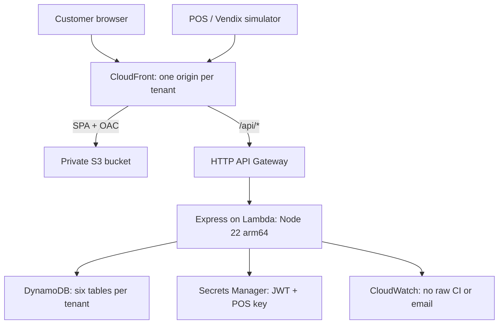

# Club Rachas

White-label monthly loyalty streaks for Farmaenlace in Ecuador. EcoClub serves Farmacias Económicas; FarmaClub connects Medicity, Wellderma, Mascotas and Ambiente. Customers join with cédula + email, accumulate purchases across their club each calendar month, and redeem earned benefits at the counter. All customer screens and receipt text use Spanish, USD and America/Guayaquil.

The source of truth is [spec/SPEC-000.md](spec/SPEC-000.md). The workspace has four strict TypeScript ESM packages:

| Package        | Responsibility                                                                                                             |
| -------------- | -------------------------------------------------------------------------------------------------------------------------- |
| `@club/shared` | Pure CI, money, month, tier, streak, reward and receipt rules; schemas; tenant configuration; neutral table specs          |
| `@club/api`    | Express 5 API, JWT/POS authentication, services, memory/DynamoDB repositories, Lambda entry point, local setup and seeding |
| `@club/ui`     | React 19 SPA, customer account, reward wallet, purchase history, POS simulator and printable registration posters          |
| `@club/infra`  | CDK stacks, data tables, API Gateway/Lambda, S3/CloudFront hosting, optional GitHub OIDC role                              |



## Run locally

Use Node 22.12 or later in the Node 22 LTS line, pnpm 10 (the exact version is in `packageManager`), and optionally Docker.

```sh
nvm use
corepack enable
pnpm install
cp packages/api/.env.example packages/api/.env
pnpm dev:ecoclub
```

Open `http://localhost:5173`. The example selects `DATA_DRIVER=memory`, automatically seeds synthetic demo data and uses the deliberately fake development key `obviously-fake-local-pos-key`. Enter it at `/caja`. The JWT example secret is also strictly for local use. Never use these values in an AWS environment.

Run FarmaClub instead with `pnpm dev:farmaclub`. Stop the first dev command before switching because both use ports 3000 and 5173. Each tenant's customer token and POS key use separate storage keys. Customer tokens live in localStorage, POS credentials only in sessionStorage; the current session still works if browser storage is disabled.

For persistent local API tests and the real DynamoDB driver:

```sh
docker compose up -d dynamodb
# Change DATA_DRIVER=dynamodb in packages/api/.env
pnpm --filter @club/api db:setup --tenant all
pnpm --filter @club/api seed --local --tenant all --demo
pnpm dev:ecoclub
```

DynamoDB Local uses in-memory storage: container restart clears it. Rerun setup/seed afterwards. Local table names are `<tenant>-local-<logicalName>`. The DynamoDB client supplies fake local credentials automatically. Pass arguments directly to pnpm scripts, without an extra `--` separator.

## Demo walkthrough

| Tenant    | Cédula       | Starting point                                                                                                 |
| --------- | ------------ | -------------------------------------------------------------------------------------------------------------- |
| EcoClub   | `1700000001` | Two earlier Silver months; $12 this month. A $3 purchase unlocks the Silver choice.                            |
| EcoClub   | `1700000019` | $18 this month, reproducing the golden receipt.                                                                |
| EcoClub   | `0900000001` | Registered, no purchases.                                                                                      |
| FarmaClub | `1700000027` | Two earlier Gold months; $100 this month across Medicity and Mascotas. $20 unlocks the Gold experience choice. |
| FarmaClub | `0900000019` | Bronze at Wellderma only.                                                                                      |

1. Log in at `/ingresar` with `1700000001`.
2. Open `/caja`, enter the local POS key and select Farmacias Económicas.
3. Record a $3 purchase with a new transaction ID. The receipt announces the Silver reward and its code.
4. Open `/recompensas`, select **Por elegir**, then choose the $2 coupon or early access.
5. Look up the code under **Canje** in `/caja` and redeem it. It moves to **Usadas** in the wallet.
6. Replay the same transaction ID to see the exact saved result without adding spend or issuing another reward.

New synthetic customers `1700000035` and `1700000043` can exercise web and assisted registration. At the POS an unregistered customer requires email and verbal consent; the registration and purchase happen through one call.

## Rules and reliability

Money remains integer cents. Dollar input is parsed as a decimal string. Month boundaries are always UTC−05:00, including Galápagos. Tier thresholds are lower-inclusive; higher tiers also qualify for lower-tier streaks. Missing calendar months reset a streak. The current month can display **En riesgo** while the immediately preceding streak can still be saved.

Bronze rewards unlock on reaching the threshold each month. Silver and Gold unlock every three consecutive qualifying months. Due rewards are evaluated during purchases and use deterministic instance IDs, with conditional puts for exactly-once issuance. Delivery installments have independent calendar validity windows. Choice rewards snapshot all options, then save one through a conditional transition. Expiration is computed at read time; redemption is always a conditional POS operation.

The purchase ledger and progress increments share a DynamoDB transaction. Concurrent conflicts retry with bounded backoff. Replay repairs issuance after an interrupted write, then returns a conditionally stored original response. The 72-hour historical sync window applies to every HTTP purchase. Demo seeding alone uses a service-level historical import flag to populate earlier months; it is never accepted by HTTP. Late previous-month purchases are evaluated for that month, with later rewards catching up on the later month's next purchase.

The catalog is read from DynamoDB and validated with zod, then cached for 60 seconds. Invalid definitions fail safely. UI branding is fixed in each tenant build, while thresholds and benefits remain runtime data. Seeding is idempotent, retains explicit config versions, and refuses `--demo --stage prod`.

## Validation

```sh
pnpm format:check
pnpm lint
pnpm typecheck
pnpm test
DYNAMODB_ENDPOINT=http://localhost:8000 pnpm test:coverage
pnpm build
pnpm synth
pnpm synth:prod
```

Integration tests skip if `DYNAMODB_ENDPOINT` is unset. Coverage enforcement belongs to the full suite with DynamoDB Local (as run in CI): shared ≥90% lines/branches, API ≥80%, UI ≥60%. Tests cover the exact golden receipt, month/year boundaries, repeated unlock cycles, registration/login, every redemption rejection reason, ten parallel purchases and parallel replays, UI flows, tenant metadata, and secure synthesized infrastructure. Synthesis uses no account lookups or AWS credentials. Build both UI assets before synthesizing.

TypeScript uses the newest 6.0.x release supported by typescript-eslint 8; MSW uses Vitest 5's supported 2.x peer. These compatibility decisions are recorded in the spec. Lockfile resolution fixes the rest of the dependency graph.

## AWS deployment

Each stage has `EcoClub-<stage>` and `FarmaClub-<stage>` in `us-east-1` by default. Every stack has six on-demand, encrypted, PITR-enabled tables; private TLS-only S3 with OAC; CloudFront SPA rewrites only on the default web behavior; `/api/*` proxies to the HTTP API without caching; Node 22 arm64 Lambda; generated JWT/POS secrets; security headers and CSP; throttling and sanitized access logs. Production retains and protects tables and retains logs and versioned assets.

Assets upload before `index.html`, with immutable cache headers. Previous hashed assets are retained so an old page continues working. SPA fallback never rewrites API errors. Fonts are self-hosted; no third-party runtime requests are required.

The default CloudFront hostname uses AWS’s fixed TLSv1 viewer security policy. The requested TLS 1.2 viewer minimum cannot be enforced until a custom domain and certificate are added; this spec correction is documented in §8. HTTPS redirects and HSTS are enforced. See the [AWS certificate reference](https://docs.aws.amazon.com/cloudfront/latest/APIReference/API_ViewerCertificate.html).

One-time setup, with appropriate AWS credentials:

```sh
pnpm build
pnpm --filter @club/infra exec cdk bootstrap aws://ACCOUNT_ID/us-east-1
pnpm --filter @club/infra exec cdk deploy Club-GithubOidc \
  -c bootstrapOidc=true -c githubRepo=OWNER/REPO
```

If the AWS account already has the GitHub OIDC provider, use it in a manually configured role rather than creating a duplicate provider. Set GitHub repository secret `AWS_DEPLOY_ROLE_ARN` to the role output; optionally set variable `AWS_REGION`. Create the `production` environment and restrict its deployment branches to `main`. The role trusts main-branch and production-environment subjects. It can assume the CDK bootstrap roles, describe club stacks and seed only club tables. Production seeding does not read secret values.

The PR workflow runs reusable verification against DynamoDB Local. Pushes to `main` run the same checks, build both tenants, assume the role using OIDC, deploy, seed the production catalog and publish both CloudFront links in the job summary. Weekly Dependabot updates and an informational production audit are configured.

Manual deployment:

```sh
pnpm --filter @club/infra exec cdk deploy --all -c stage=dev
pnpm --filter @club/api seed --stage dev --tenant all
```

Select one tenant with `-c tenants=ecoclub`. Stack outputs include web/API URLs, table names and secret ARNs. Retrieve the POS secret using your authorized AWS tooling; secret values are never printed by production seeding or embedded in templates. There are no custom domain, Route 53 or ACM resources.

## API contract

All paths start with `/api`. Responses are JSON. Errors use `{ error: { code, message, details?, reason? } }` with Spanish safe messages. Amounts use cents; dates include an ISO offset. Requests are limited to 10 KB. Customer routes require `Authorization: Bearer <jwt>`. POS routes require `x-api-key` and `x-business-id`.

| Method | Path                       | Auth     | Behavior                                                            |
| ------ | -------------------------- | -------- | ------------------------------------------------------------------- |
| GET    | `/health`                  | Public   | Health, tenant, version                                             |
| GET    | `/program`                 | Public   | Active catalog, cache for 300 seconds                               |
| POST   | `/auth/register`           | Public   | CI, email, `acceptPrivacyPolicy: true`, optional source; auto-login |
| POST   | `/auth/login`              | Public   | CI-only session, expires in 30 days                                 |
| GET    | `/me`                      | Customer | CI, masked email, registration metadata                             |
| GET    | `/me/progress`             | Customer | Current monthly summaries                                           |
| GET    | `/me/history?months=6`     | Customer | Zero-filled 1–12-month history                                      |
| GET    | `/me/purchases?cursor=...` | Customer | 20 purchases per page, opaque cursor                                |
| GET    | `/me/rewards`              | Customer | Wallet with computed expiry                                         |
| POST   | `/me/rewards/:code/choose` | Customer | `{ benefitId }` chooses once                                        |
| POST   | `/pos/customers`           | POS      | Idempotent assisted registration                                    |
| POST   | `/pos/customers/progress`  | POS      | CI in body, optional receipt width; reprint                         |
| POST   | `/pos/purchases`           | POS      | Transaction ID, CI, amountCents; optional email/date/store/width    |
| POST   | `/pos/rewards/lookup`      | POS      | `{ code }`                                                          |
| POST   | `/pos/rewards/redeem`      | POS      | Code, optional transactionId/benefitId                              |

Purchase example:

```json
{
  "transactionId": "VX-000123",
  "ci": "1700000043",
  "email": "cliente@example.com",
  "amountCents": 300,
  "receiptWidth": 40
}
```

Created purchases return 201; identical `(businessId, transactionId)` replays return 200 and the original response. Different CI or amount returns 409 `TRANSACTION_CONFLICT`. An unknown CI without email returns 404 `CUSTOMER_NOT_FOUND`. Dates outside −72 hours / +5 minutes return 422 `PURCHASE_OUT_OF_WINDOW`. Receipt widths are 32, 40 or 48 columns, with ASCII folding for thermal output and original Spanish accents for digital text.

Redemption returns 409 `REWARD_NOT_REDEEMABLE` with `ALREADY_REDEEMED`, `EXPIRED`, `NOT_YET_VALID`, `PENDING_CHOICE` or `WRONG_BUSINESS`. A cashier can pass `benefitId` to choose and redeem atomically. The business applies the actual discount or service; this API validates and consumes codes.

## Add a tenant

1. Add a validated `TenantConfig` under `packages/shared/src/tenants`, including identity, palette, businesses, tiers and reward snapshots.
2. Extend the `TenantId` and prefix unions, `TENANTS` registry, request/config zod enums, code validation and API tenant environment schema.
3. Add `packages/ui/.env.<tenant>` and its original SVG favicon. Extend the UI tenant resolver and build/dev scripts.
4. Extend seed/setup CLI selection, demo plans if wanted, and CI role resource patterns. CDK's default tenant iteration picks up the registry entry.
5. Add metadata/config tests and synthesize a separate stack. Seed the tenant catalog after deploying it.

Changing an existing tenant's thresholds requires editing/versioning the seed config and reseeding, or editing a valid definition in DynamoDB. Changing branding requires rebuilding the tenant SPA.

## Assumptions and future work

Implemented business assumptions A1–A11 are listed in the spec: EcoClub is the Económicas league; rewards accumulate across tiers; “cashback” means a single-use next-purchase discount; “or” rewards are customer choices; three-month cycles repeat; Gold delivery issues three coupons; spend means net paid; all month boundaries use Guayaquil; POS has a tenant-wide key; no emails are sent; exact thresholds enter the next tier.

CI-only login is intentionally weak because CIs can be known by others. Responses mask email, no profile mutation exists, JWTs are tenant-scoped, and rewards require in-person POS redemption; cashiers may verify the physical cédula. Consider email OTP step-up before revealing codes. Logs omit bodies, raw CIs, emails and secrets. Consent records include policy version, date and web/verbal channel.

Before production use, review the provisional privacy notice and define LOPDP data export/deletion procedures, contact details and retention policy. Other follow-ups: real Vendix integration and receipt templates; refunds/reversals; email delivery after domain verification; admin catalog UI; custom domains; per-business POS keys and rotation. No customer data export/deletion endpoint, refund flow or email transport is included in the MVP.
